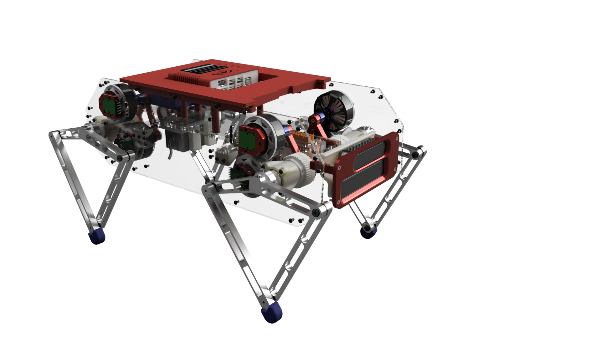
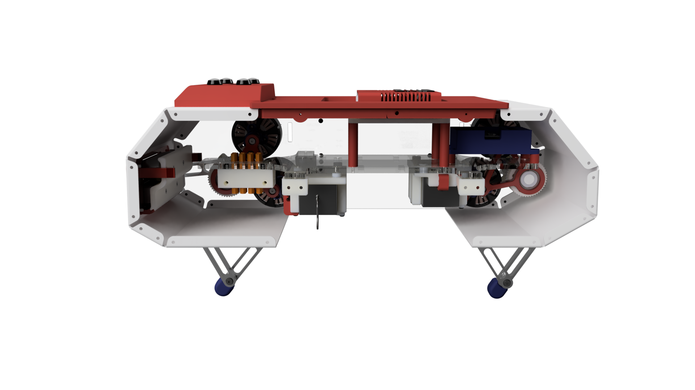

# Sparkie, Autonomous inspections for process industry by a quadruped robot with use of neural networks
We seek to prove that an autonomous industrial robot can optimize inspections operations in a process industry. With doing so, we wish to eliminate unnecessary human interaction, as this can be dangerous, complicated and expensive. In this paper, the emphasis is on design, machine learning, and finally the usability of the robot. During consideration of different choices,the priority will be on robustness, speed and accuracy.

In development ...

Front right view           |  Rear view                |  Side view
:-------------------------:|:-------------------------:|:-------------------------:
  |     |  

Progress video 1           |  Progress video 2         |  Progress video 3         |  Progress video 4
:-------------------------:|:-------------------------:|:-------------------------:|:-------------------------:
  |     |     |  

## Demo

## Pictures and  3D-model
[Pictures](https://drive.google.com/drive/folders/175Xf5eR7ISFx6bbiMSzkLT8xGgaTwL8Q) \
[3D-model](https://drive.google.com/drive/folders/1SjDRSZ7dCbtEyQgJi2F-tcV4agTJ8wo_)

## Report

[Report, coming](https://www.overleaf.com/project)

## Built With

* [ROS](https://www.ros.org/) - ROS

* [C++](http://www.cplusplus.com/) - C++

* [Arduino](https://www.arduino.cc/) - Arduino

* [Python](https://www.python.org/) - Python

## Authors

* **Magnus Øye** - [magnusoy](https://github.com/magnusoy)

* **Vegard Solheim** - [solheim95](https://github.com/solheim95)

* **Petter Drønnen** - [dr0nn1](https://github.com/dr0nn1)

## License

This project is licensed under the MIT License - see the [LICENSE.md](https://github.com/magnusoy/Sparkie-Quadruped-Robot/blob/master/LICENSE) file for details
